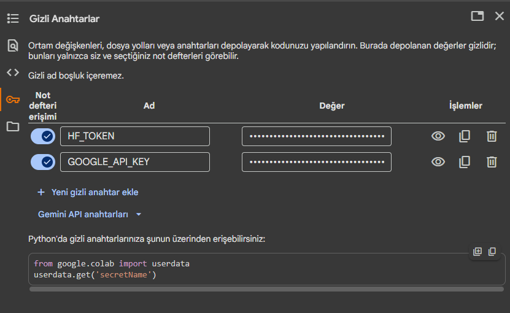
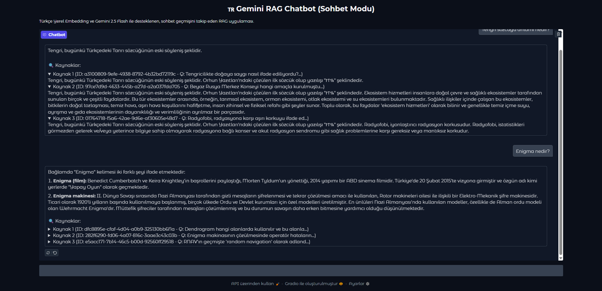

# Akbank GenAI Bootcamp: RAG Chatbot Projesi
Generative AI 101 Bootcamp için hazırlanmış Türkçe RAG (Retrieval-Augmented Generation) tabanlı chatbot projesi.

## Proje Hakkında
Bu proje, RAG (Retrieval Augmented Generation) mimarisi kullanarak **Metin/WikiRAG-TR** veri seti üzerinde çalışan bir **Soru-Cevap (Q&A)** chatbot geliştirmeyi amaçlamaktadır. Proje, **Gemini API**'ı kullanarak veriye dayalı, doğru ve bağlamsal olarak zenginleştirilmiş yanıtlar sunmayı hedeflemektedir.


## Kullanılan Yöntemler ve Teknolojiler

* Generation Model: Gemini API
    * Google'ın geliştirdiği model olup, Gemini API ve **google-genai SDK** ile hızlıca uygulanabilmesinin, Türkçe RAG görevlerinde kullanım kolaylığı sağlamaktadır. Kullanımı için API anahtarı gerekmektedir.

* RAG Framework: LangChain
    * RAG projeleri için en yaygın kullanılan ve en geniş topluluk desteğine sahip framework'tür. Gemini API'a özgü entegrasyonları hızlıca uygulanabilir.

* Embedding Model: trmteb/turkish-embedding-model
    * Gemini API ile sorunsuz entegrasyon sağlar ve genellikle LangChain ile uyumludur. Hugging Face platformunda yer alan bu model için API anahtarının bulunması gerekmektedir.

* Vektör Veritabanı: Chroma
    * Kurulumu ve kullanımı son derece kolay, hafif (in-memory) bir veritabanıdır. Colab ortamında hızlı prototipleme ve test için idealdir.

* Web Arayüzü: Gradio
    * Python kodu üzerinden minimal çabayla profesyonel ve etkileşimli web uygulamaları oluşturmanızı sağlayan, projenin arayüz katmanı, Makine Öğrenimi demoları için optimize edilmiş ve Colab Notebook ortamında son derece stabil çalışan kütüphanedir.

## Kurulumu

### 1. Localde Çalıştırma

#### 1. Paketleri Yükleme

```bash
# Virtual environment oluşturun (opsiyonel ama önerilir)
python -m venv .venv
source .venv/bin/activate  # macOS/Linux

.venv\Scripts\activate  # Windows

# Paketleri yükleyin
pip install -r requirements.txt
```

#### 2. API Anahtarları


```bash
GOOGLE_API_KEY="api_buraya"
HF_TOKEN="token_buraya"
DEVICE="cuda"
```

* `HF_TOKEN` Anahtarı, Hugging Face Platformu içerisinden alınacak anahtarı içermektedir. Anahtarı alabilmek için [bağlantı](https://huggingface.co/settings/tokens)'ya tıklayarak `Create New Token` butonuna tıklayarak token bilgisini alabilirsiniz.
* `GOOGLE_API_KEY` anahtarını ise [bağlantı](https://aistudio.google.com/api-keys)'ya tıklayarak açılacak olan sayfadan `Create Api Key` butonuna tıklayarak alabilirsiniz.
* Veri setini incelemek için [bağlantı](https://huggingface.co/datasets/Metin/WikiRAG-TR)'ya tıklayarak ulaşabilirsiniz.

#### 3. Uygulamayı Başlat

```bash
python rag.py
```

    Not: Gradio çoğunlukla https://localhost:786*/ şeklinde bağlantı oluşturmaktadır. `*` karakteri, konsolda görüleceği gibi 0-9 arasında sayılar olabilir. Kod çıktısında bağlantıyı direkt oluşturabilmektedir.


### 2. Colab İle Çalıştırma


    Not: Verilen .ipynb uzantılı dosyanın, Colab ile çalıştırılacak şekilde hazır olduğu düşünülmüştür. Colab'a giriş yaptığınız gibi yeni not defteri ve yükle diyerek notebook dosyasını yükleyebilirsiniz.

Projenin çalıştırılabilmesi için verilen bağlantı ile aşağıdaki bilgilerin girilmesi gerekmektedir:
* **`Gizli Anahtarlar`** sekmesi altında yer alan bilgilerin aşağıdaki gibi doldurulması gerekmektedir.
    
    * `HF_TOKEN` Anahtarı, Hugging Face Platformu içerisinden alınacak anahtarı içermektedir. Anahtarı alabilmek için [bağlantı](https://huggingface.co/settings/tokens)'ya tıklayarak `Create New Token` butonuna tıklayarak token bilgisini alabilirsiniz.
    * `GOOGLE_API_KEY` anahtarını ise [bağlantı](https://aistudio.google.com/api-keys)'ya tıklayarak açılacak olan sayfadan `Create Api Key` butonuna tıklayarak alabilirsiniz.
* **`Çalışma Zamanı -> Çalışma Zamanı Türünü Değiştir`** butonlarıyla `T4 GPU` seçeneğinin seçilmiş olması gerekmektedir. `Embedding` aşamasında hesaplanacak olan vektörlerin CPU ile çalışmasının, GPU'ya oranla aşırı fark etmesinden dolayı bu yol tercih edilmiştir.
* `Tümünü Çalıştır` butonuna tıkladıktan sonra gereken kütüphaneleri yükleyerek başlar, `pipeline` ve `model` aşamalarını çalıştırdıktan sonra `Gradio` ile kullanılabilecek bir `chatbot` arayüzü göstermektedir. Eğer istenilirse `localhost` uzantılı link ile yeni bir sekmede erişilebilmesi daha kolay bir uygulama göstermektedir.

## Proje Yapısı
    .
    ├── .env.example        # Örnek çevre değişkenleri.
    ├── assets              # Görsellerin bulunduğu klasör.
    ├── requirements.txt    # Python bağımlılıkları
    ├── rag.py              # Localde çalıştırılabilecek proje
    ├── RAG.ipynb           # Colabta çalıştırılabilecek notebook dosyası
    ├── README.md           # Bu dosya

## Nasıl Çalışır?

* **Veri Yükleme**: Hugging Face'ten **Metin/WikiRAG-TR** veri seti indirilir. İndirilen veri setinden istenilen miktarda veri çekilebilecek şekilde düzenlenmiştir.
* **Belge İşleme**: Tezler küçük parçalara bölünür. `chunk_size=1000` şeklinde ayarlama ile büyük veriler parçalanmıştır.
* **Embedding**: Her parça **trmteb/turkish-embedding-model** modeli ile vektöre dönüştürülür.
* **Vektör Veritabanı**: `Chroma` ile vektörler InMemory document store'da saklanır.
* **Sorgulama**: Kullanıcı sorusu embedding'e dönüştürülür ve en ilgili belgeler bulunur.
* **Yanıt Üretimi**: `gemini-2.5-flash` Gemini modeli, bulunan belgelerden yararlanarak yanıt oluşturur.

## Örnek Sorular ve Cevapları
### Colab ile 5000 Örnek Üzerinde Verilen Cevaplar ve Analizleri
Başlangıçta Colab'ın sunduğu T4 GPU seçeneği ile 5000 verinin yaklaşık 300 saniyede kullanılabilecek duruma getirdiği, kullanılacak kaynakların Colab üzerinde görünen değerlere bakılırsa 3.2GB sistem, 1.8GB GPU RAM ihtiyaç duyulduğu görülmüştür. Uygulama başlarken 1.2GB RAM kullanımını göz önüne alırsak 2GB RAM'in doğrudan `Vektör` depolaması için kullanılabileceği sonuçları çıkmaktadır.

#### 1. Tarih Testi (Kritik Retrieval Hatası)

* **Soru:** 1923'te Türkiye'de hangi önemli olay gerçekleşmiştir?
* **Yanıt:** Elimdeki bilgilere göre bu soruya net bir yanıt veremiyorum.
* **Çekilen Kaynak Sayısı:** 3
* **Analiz:**
    * **Hata:** Çekilen 3 kaynak da (Örn: Hitler'in denizaltı planları, Montrö) tamamen 1923 ile alakasız (1930'lar/II. Dünya Savaşı dönemi) içeriktedir.
    * **Sonuç:** Türkçe Embedding modeli, **"1923"** terimini hatalı bir şekilde genel "Türkiye Tarihi" bağlamlarıyla eşleştirmiştir. Kaynaklar alakasız olduğu için, modelin yanıt vermeyi reddetmesi (hallucination yapmaması) doğrudur.

#### 2. Dil/Etimoloji Testi (Başarılı Sonuç)

* **Soru:** Tengri sözcüğünün anlamı nedir?
* **Yanıt:** Tengri, bugünkü Türkçedeki Tanrı sözcüğünün eski söyleniş şeklidir.
* **Çekilen Kaynak Sayısı:** 3
* **Analiz:**
    * **Başarı:** Kaynak 1, 2 ve 3'ün tümü, sorunun cevabını içeren net bir bilgiyle başlamaktadır.
    * **Sonuç:** Bu örnek, bilgi setindeki net tanımlara dayalı sorgularda sistemin doğru çalıştığını kanıtlar. Retrieval ve Generation zinciri başarılıdır.

#### 3. Biyografi Testi (Kritik Embedding Hatası)

* **Soru:** Alan Tuning kimdir?
* **Yanıt:** Elimdeki bilgilere göre bu soruya net bir yanıt veremiyorum.
* **Çekilen Kaynak Sayısı:** 3
* **Analiz:**
    * **Hata:** Tüm çekilen kaynaklar, sorudaki **"Alan Tuning"** yerine, fonetik olarak benzer olan **"TuneIn"** adlı radyo uygulaması hakkındadır.
    * **Sonuç:** Embedding modeli, "Tuning" ve "TuneIn" kelimelerini fonetik benzerlik nedeniyle anlamsal olarak yanlış sınıflandırmıştır. Modelin yanlış bağlama rağmen yanıt üretmeyerek "hallucination"dan kaçınması olumlu bir davranıştır.

### Localde Çalışan ve 100 Örnek Üzerinden Verilen Cevaplar ve Analizleri
Bunun temelde bir test olması ve kendi cihazlarınızda çalıştıracağınız uygulamaların kaynak ihtiyacı açısından 100 veri ile eğitilebilmesi uygun görülmüş, `batch_size` gibi değerler ile çalıştırılabilmesi amaçlanmıştır. Kulanılan sistem 3.3GB, GPU için 5.8GB RAM ile vektörler için alan ayırmaktadır. Sınırlandırılan 100 adet veri, 421 parçaya ayrılmış, 162 Saniye içerisinde kullanılacak şekilde hazırlanmıştır. Ortalama yanıt süreleri ise 2.5 saniye olacak şekilde görülmüştür.

### Örnek 1: Tarihi Olay Sorgusu

* **Soru:** 1923'te Türkiye'de hangi önemli olay gerçekleşmiştir?
* **Gemini Yanıtı:** Elimdeki bilgilere göre bu soruya net bir yanıt veremiyorum.
* **Çekilen Kaynak Sayısı:** 3
* **Analiz:**
    * **Hata:** Çekilen 3 kaynak da (Örn: Hitler'in denizaltı planları, Montrö, Romanya'nın taraf değiştirmesi) tamamen 1923 ile alakasız (1930'lar/II. Dünya Savaşı dönemi) içeriktedir.
    * **Neden:** Türkçe Embedding modeli, **"1923"** terimini hatalı bir şekilde genel "Türkiye Tarihi" bağlamlarıyla eşleştirmiştir. Kaynaklar alakasız olduğu için, modelin halüsinasyon yapmayı reddederek **"Yanıt veremiyorum"** demesi (LLM'in görevi) doğrudur.

### Örnek 2: Mitolojik Terim Sorgusu

* **Soru:** Tengri sözcüğünün anlamı nedir?
* **Gemini Yanıtı:** Elimdeki bilgilere göre bu soruya net bir yanıt veremiyorum.
* **Çekilen Kaynak Sayısı:** 3
* **Analiz:**
    * **Hata:** Çekilen kaynaklar (Kabulgan [Şekil Değiştirme kavramı], Gaucho teriminin kökeni, Siri Remote) **Türk veya Altay mitolojisi/kültürü** ile ilgili olsa da, spesifik olarak **"Tengri"** kelimesinin tanımını veya kökenini içeren bir kaynak getirilememiştir.
    * **Neden:** Embedding modeli, **"Tengri"** terimini semantik olarak **"Kabulgan"** veya **"Gaucho"** gibi diğer mitolojik/kültürel terimlerin bulunduğu bölümlerle karıştırmıştır. **"Şekil Değiştirme" (Kabulgan)** kavramının anlamı yakalanmış, ancak **"Tengri"** tanımını içermediği için Retrieval başarısız olmuştur.

### Örnek 3: Biyografi Sorgusu

* **Soru:** Alan Tuning kimdir?
* **Gemini Yanıtı:** Elimdeki bilgilere göre bu soruya net bir yanıt veremiyorum.
* **Çekilen Kaynak Sayısı:** 3
* **Analiz:**
    * **Hata:** Çekilen kaynakların hiçbiri Alan Turing ile ilgili değildir. Kaynaklar: Hugging Face şirketi, Hans Georg Gadamer (Alman Felsefeci), Toast POS (Restoran Yazılım Şirketi).
    * **Neden:** Retrieval sistemi, **"Alan Tuning"** ismini yakalamış, ancak veri tabanında ilgili biyografik bilgiyi bulamamıştır. Bunun yerine, bilim, teknoloji, felsefe ve şirketler gibi **genel olarak benzer kategorilerdeki** (domain-level similarity) alakasız isimleri (Gadamer, Toast kurucuları) veya kurumları (Hugging Face) getirmiştir.
    * **Sonuç:** Modelin doğru bilgiyi **bulamaması** ve **uydurmaması** doğrudur. Ancak Retrieval aşaması, sorgu ile kaynak arasındaki **anlamsal boşluğu** kapatamamıştır.

---

### Genel Değerlendirme ve Çıkarımlar (Video İçin Kritik)

Bu testler, sonuçların üç zayıf yönünü net bir şekilde göstermiştir:

1.  **Semantik Aşırı Genelleme:** Embedding modeli, "1923" gibi spesifik bir terimi, veri kümesindeki genel "Türkiye Tarihi" içeriğinden, "Tengri" terimini ise "Mitoloji/Kültür" içeriğinden doğru bir şekilde ayırt edemiyor.
2.  **Veri Kısıtlılığı:** Sistem, Alan Turing gibi bir konuya dair bilgi **içermediğinde**, en alakalı olana değil, sadece **en az alakasız olana** yöneliyor ve hatalı kaynaklar getiriyor.
3. **Kaynak Tüketimi:** Uygulamanın hazırlayacağı verilerin fazla olmasının, kaynak tüketimi olarak fazla olabileceğini göstermektedir. Bu duruma göre verilerin kısıtlanması gerekeceği gibi problemleri ortaya çıkaracaktır.

Bu durum, Retrieval aşamasının kalitesini artırmak için **daha iyi bir Embedding Modeli** veya **Meta Veri Filtreleme (Metadata Filtering)** gibi Gelişmiş RAG tekniklerine ihtiyaç duyulduğunu kanıtlar.

## Gradio Önizlenimi
Aşağıdaki görselde `Gradio` ile çalışan chatbot görseli paylaşılmıştır.


**Proje Colab Adresi:**
* https://colab.research.google.com/drive/1Aq4dNeWjQdcgGMd9_kvOg2-7VLdt0Ak_?usp=sharing

**Videolu Açıklama**
* https://youtu.be/7JNrDCKwy2Y
